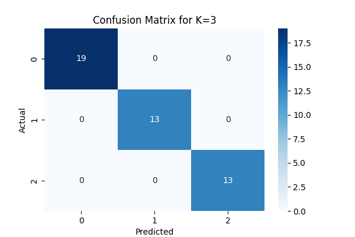

# K-Nearest Neighbors (KNN) Classification on Iris Dataset

This project demonstrates the **K-Nearest Neighbors (KNN)** algorithm applied to the classic **Iris dataset**.  
It includes data preprocessing, model training, evaluation metrics, and visualizations to understand the classifier's performance.  
Developed by **Harisivanarayana** as part of AI & ML Internship **Task 6**.

## 📌 Features
- Load and inspect the Iris dataset.
- Feature scaling for better accuracy.
- Train-test data splitting for validation.
- Experiment with different K values and compare accuracy.
- Evaluate performance using:
  - Accuracy score
  - Confusion matrix
  - Classification report
- Visualize decision boundaries for better interpretation.

## 🛠️ Technologies Used
- Python 3.x
- scikit-learn
- pandas
- numpy
- matplotlib
- seaborn

## 🚀 How to Run
1. Clone this repository:
   ```bash
   git clone https://github.com/<Harisivanarayana>/knn-iris-classifier-harisivanarayana.git
2. Navigate to the project directory:
   ```bash
   cd knn-iris-classifier-harisivanarayana
3. Install dependencies:
   ```bash
   pip install -r requirements.txt
4. Run the script:
   ```bash
   python knn_classification.py

## 📸 Screenshot



✨ Keep Exploring and Keep Coding! 🚀**
